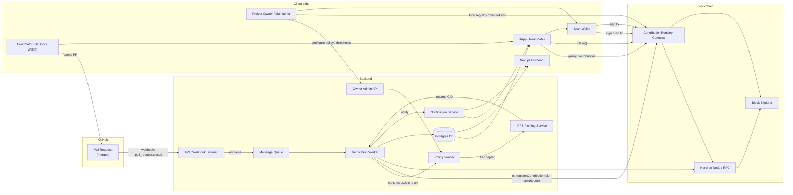

# MergeMint

A full-stack system for rewarding open-source contributions **on-chain**.
It listens for merged GitHub Pull Requests (PRs), verifies them against a policy, stores evidence on IPFS, and registers the contribution on an Ethereum smart contract.
Contributors can then claim rewards in **ETH** or **ERC-20 tokens** through the DApp interface.

---

## 🚀 Overview

### Key Features

* **Automatic PR detection:** GitHub webhook triggers the backend on merge.
* **Policy-based verification:** Ensures only eligible PRs (e.g., minimum lines of code) are rewarded.
* **IPFS Evidence:** Stores a tamper-proof record of contribution metadata.
* **On-chain registry:** Records contributions via smart contracts.
* **Reward claim system:** Contributors can claim ETH or token-based rewards.
* **Dockerized setup:** One command to spin up the full stack locally.

---
## Demo Video (Screen Recording)

https://github.com/user-attachments/assets/78827c02-3328-4108-be95-0d26bcfd444a

---

## 🧩 Project Structure

| Folder         | Description                                                                          |
| -------------- | ------------------------------------------------------------------------------------ |
| **contracts/** | Solidity smart contracts (Hardhat) for the on-chain registry and token.              |
| **backend/**   | Node.js + Express server for handling GitHub webhooks, policies, and contract calls. |
| **dapp/**      | React (Vite) frontend for contributors and project owners.                           |
| **frontend/**  | A minimal Next.js interface.                                                         |
| **docker/**    | Docker and Compose configuration for local development.                              |
| **test/**      | Hardhat tests and utility scripts.                                                   |

---

## 🧠 System Architecture



---

## 🤪 Local Setup Guide

### 1. Prerequisites

Ensure the following are installed:

* [Docker](https://docs.docker.com/get-docker/)
* [Docker Compose](https://docs.docker.com/compose/)
* [Node.js (v18+)](https://nodejs.org/) (optional, for local debugging)

---

### 2. Clone the Repository

```bash
git clone https://github.com/<your-username>/git-onchain-rewards.git
cd git-onchain-rewards
```

---

### 3. Create Environment File

Create a `.env` file at the project root (or inside `/docker`) with the following minimal variables:

```bash
# Default Hardhat local key (insecure, for local use only)
VERIFIER_PRIVATE_KEY=0xac0974bec39a17e36ba4a6b4d238ff944bacb478cbed5efcae784d7bf4f2ff80
REGISTRY_ADDRESS=0xe7f1725E7734CE288F8367e1Bb143E90bb3F0512
ENABLE_ONCHAIN=true

# Optional GitHub credentials
GITHUB_CLIENT_ID=your_client_id
GITHUB_CLIENT_SECRET=your_client_secret
GITHUB_WEBHOOK_SECRET=your_webhook_secret
```

> Tip: Create a `.env.example` for reference and **never commit real secrets**.

---

### 4. Run the Project Locally

Start all services using Docker Compose:

```bash
docker compose -f docker/docker-compose.yml up --build -d
```

This will:

* Build and run all containers (backend, dapp, hardhat node, DB, etc.)
* Deploy smart contracts to the local Hardhat node
* Connect backend and frontend automatically

---

### 5. Access the Services

| Service                         | URL                                            |
| ------------------------------- | ---------------------------------------------- |
| **DApp (Main UI)**              | [http://localhost:5173](http://localhost:5173) |
| **Backend API**                 | [http://localhost:4000](http://localhost:4000) |
| **Block Explorer (Blockscout)** | [http://localhost:4001](http://localhost:4001) |
| **Otterscan Explorer**          | [http://localhost:4002](http://localhost:4002) |

Logs can be checked using:

```bash
docker compose logs -f backend
```

---

## ⚙️ Manual Workflow (Optional)

1. Start Hardhat manually:

   ```bash
   cd contracts
   npx hardhat node
   ```
2. Deploy the contracts:

   ```bash
   npx hardhat run scripts/deploy.js --network localhost
   ```
3. Start the backend:

   ```bash
   cd ../backend
   npm install
   npm run dev
   ```
4. Start the frontend DApp:

   ```bash
   cd ../dapp
   npm install
   npm run dev
   ```

---

## 🧱 Technologies Used

| Layer                  | Technology                   |
| ---------------------- | ---------------------------- |
| **Smart Contracts**    | Solidity, Hardhat            |
| **Backend**            | Node.js, Express, PostgreSQL |
| **Frontend (DApp)**    | React, Vite                  |
| **Secondary Frontend** | Next.js                      |
| **Containerization**   | Docker, Docker Compose       |
| **Blockchain Dev**     | Hardhat local node           |
| **Storage**            | IPFS (via API integration)   |

---

## 🛠️ Troubleshooting

| Issue                                 | Solution                                                                   |
| ------------------------------------- | -------------------------------------------------------------------------- |
| **Port already in use**               | Stop previous Docker containers: `docker compose down`                     |
| **Backend not connecting to Hardhat** | Ensure Hardhat RPC is on `http://localhost:8545`                           |
| **Contract not found**                | Check `REGISTRY_ADDRESS` in `.env` matches the deployed contract           |
| **GitHub webhook rejected**           | Ensure your `GITHUB_WEBHOOK_SECRET` matches the one set in GitHub settings |

---

## 📜 License

MIT License © 2025
Created for blockchain-based open-source contribution rewards.

---
